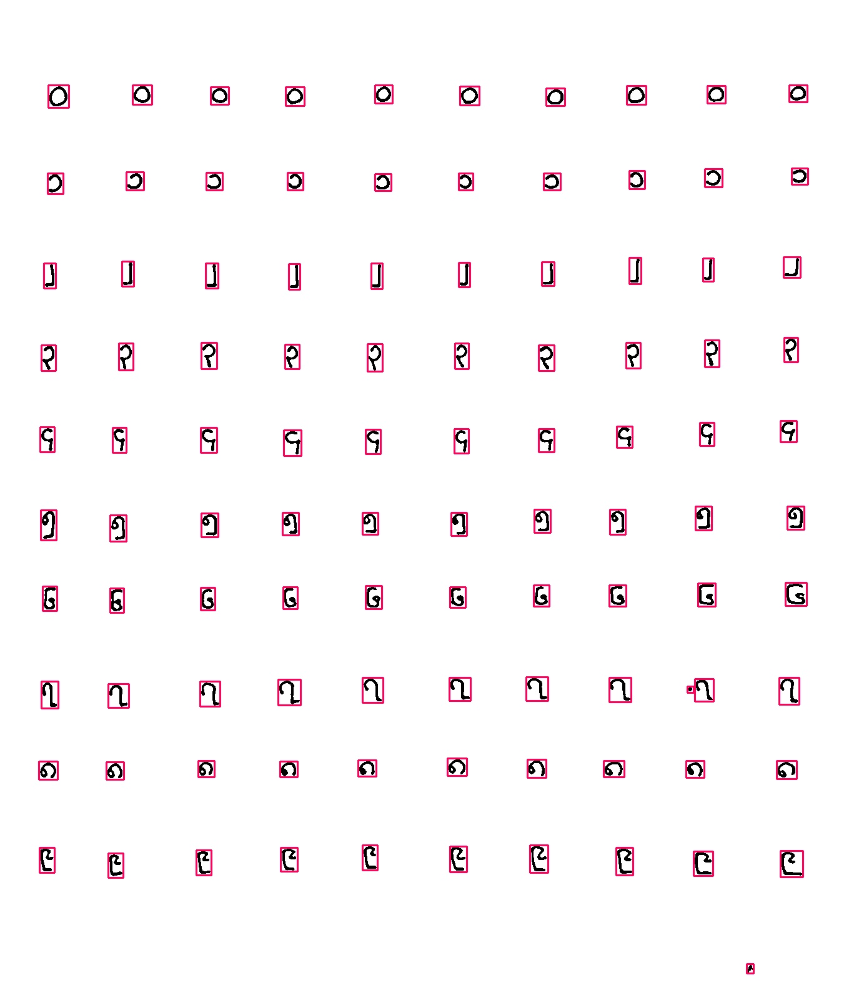

# Contour-Seg
## Contour-based Handwritten Digit Segmentation using OpenCV

We can segment characters and digits wirtten on pages for data collection purposes.
<br />
Images shall be used to train Character Recognition models.

### Usage
- 1 
  - Correct the skew 
  - BGR to Grayscale
  - Remove horizontal lines
  - Remove Vertical lines
  - Apply medium bluring
  - Apply non-localized means for final Denoising of the image
  - Binarize using adaptive threshold method
```text
python pre-process.py --input Testing.jpg
```

- 2 
  - BGR 2 Grayscale
  - Gaussian Blur
  - Dilation for thinning
  - Finding Connect Components by Contours
  - If crop mode is off, the result image is only one image with bounding boxes 
  - If crop is on, path will need to given and bounding boxes are cropped as individual images

```text
python bounding-boxes.py --crop on --path ./Digit-Images/
```

### Result



### Future Works
- Different denoising methods with respective PSNR values for benchmarking
- Image Clustering for labelling
